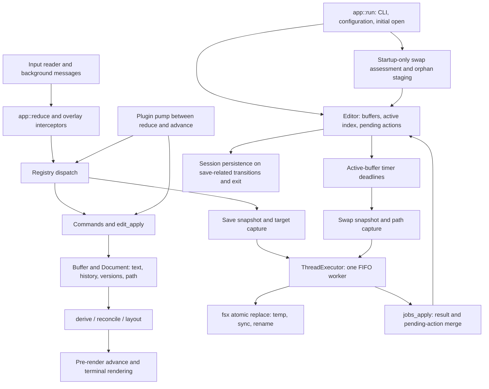

# Pass 0 — baseline and ownership map

Revision: `d3aea924988f60702529f6c68a0e332e64d44f1d`.
Continuation of the [partial pilot](2026-09-11-pilot-partial-report.md).
Pass 0 is complete at mapping depth; this is not a semantic review of every module.

## Baseline and environment

The revision and tracked sources are unchanged from the partial pilot, so its
full-workspace baseline is reused rather than rerun without cause:

| Check | Result | Evidence |
| --- | --- | --- |
| Workspace tests | 2,465 passed, 0 failed, 6 ignored, including doc-tests | [Full log](evidence/2026-09-11-pilot/baseline-tests-unrestricted.log) |
| Workspace clippy, all targets | Passed | [Log](evidence/2026-09-11-pilot/baseline-clippy.log) |
| PTY smoke, real binary | `smoke: 9/9 PASS` | [Log](evidence/2026-09-11-continuation/smoke-unrestricted.log) |
| Focused review probes | 16 passed, deliberately asserting observed defects and controls | [Log](evidence/2026-09-11-continuation/quit-paths.log) |
| Two live processes sharing a document | Shared recovery-file overwrite reproduced | [Log](evidence/2026-09-11-continuation/sessions.log) |

Sandbox runs initially failed on Unix socket creation: one unit fixture and the
private tmux server. Approved unrestricted reruns passed. These are environment
failures, not application defects. The smoke suite uses private tmux and per-check
state directories; configuration/cache were isolated too. Probes use temporary
documents and isolated state, never personal documents. No ignored live Harper
tests, benchmark, fuzz campaign, or supply-chain scan was run in this pass.

The [baseline metadata](evidence/2026-09-11-pilot/baseline.json) records Rust/Cargo
versions, revision, branch, and pre-existing untracked material. That material was
not altered. No production fix or commit was made.

## Module inventory and scope

[module-coverage.csv](evidence/2026-09-11-continuation/module-coverage.csv) assigns
all 115 Rust source files to a primary review pass and records depth and scope.
The last column contains lexical reference candidates, not a complete call graph:
aliases, reexports, generated registration, and dynamic dispatch require manual
tracing. The generator strips ordinary trailing test modules and comment-only
lines; it is a navigation aid, not a correctness verifier.

The primary division is:

- `wordcartel-core`: text storage, change sets, selections/history, parsing,
  layout/style, search, and diagnostics data; no terminal or worker ownership.
- `wordcartel`: `wcartel` terminal application, commands, buffer lifecycle,
  persistence, worker orchestration, integrations, rendering, and plugin host.
- `wordcartel-nlp`: linguistic analysis consumed by shell commands and lenses.

Pass 1 inspects durability and lifecycle. Passes 2–6 retain their scopes from the
[review plan](2026-09-10-wordcartel-module-review-plan.md). A row marked exercised
means its named scope was exercised, not every path in that file.

## Main state owners and flows

The diagram describes current code, including the active-only timer and
startup-only recovery limitations. It is not the proposed corrected design.
Language-service clients and clipboard/filter/export workers have separate
message paths; their deeper protocol/resource review belongs to Pass 5.

## Identity and ownership table

| Value | Owner and meaning | Important consumers |
| --- | --- | --- |
| `BufferId` | Editor allocation, identifies a live buffer | Worker routing, workspace operations, pending actions |
| `DocumentId` | Minted at document construction, persisted lineage hint | Swap header and session entry; not the recovery filename |
| `Document.path` | Logical/chosen path, optional | UI, normal save capture, session keys, provider URIs |
| `SaveTarget.resolved` | Resolved write destination captured for the job | Atomic file write and post-write fingerprint |
| `version` / `saved_version` | Current edit generation and last successful save generation | Dirty checks, result bookkeeping, quit/close actions |
| `stored_fp` | Last accepted disk fingerprint | Foreground external-modification check |
| Swap filename | Canonical-path hash plus chosen basename, or PID for unnamed buffers | Checkpoint write, cleanup, startup assessment |
| `swapped_version` | Buffer-local belief that its version is checkpointed | Suppresses future writes until version/state changes |
| `last_edit_at` / `last_swap_at` | Edit timing and last successful checkpoint timing | Swap debounce/maximum interval |
| `quit_drain.queue` | Snapshot of dirty buffer IDs | Save/review sequencing before process exit |
| `LAST_GOOD` | One process-global panic snapshot | Best-effort emergency dump; controlled input loss instead enumerates dirty buffers |
| Session entry key | Canonical path string | Cursor/marks/folds metadata; scratch text stored separately |

These identities are not interchangeable. Pass 1 found failures where a buffer
version was treated as proof about a different path, or multiple buffers claimed
ownership of one recovery file.

## Invariants used for review

1. A buffer reported clean must correspond to the content saved at its current
   destination, allowing explicitly detected external changes.
2. One live buffer/session cannot overwrite or remove another's only recovery copy.
3. Unsaved edits acquire checkpoint protection within the promised cadence,
   regardless of focus or edit entry point.
4. A result is interpreted using its originating identity, version, and target.
5. Quit/close must account for remaining unsaved work or explicit discard decisions.
6. A pre-rename write failure preserves the original and any recovery copy; a
   post-rename sync failure must not be described as preserving the old bytes.
7. Recovery discovery must recognize valid files produced by the writer, including
   format overhead at size boundaries.
8. Recovery must keep an on-disk carrier until ownership safely transfers.
9. Failed or suspended background work must not repeatedly wake an otherwise idle loop.

The baseline tests establish exercised behavior, not these invariants universally.
See the [Pass 1 report](2026-09-11-pass1-durability-review.md) for counterexamples,
design conflicts, controls, and remediation priorities.
