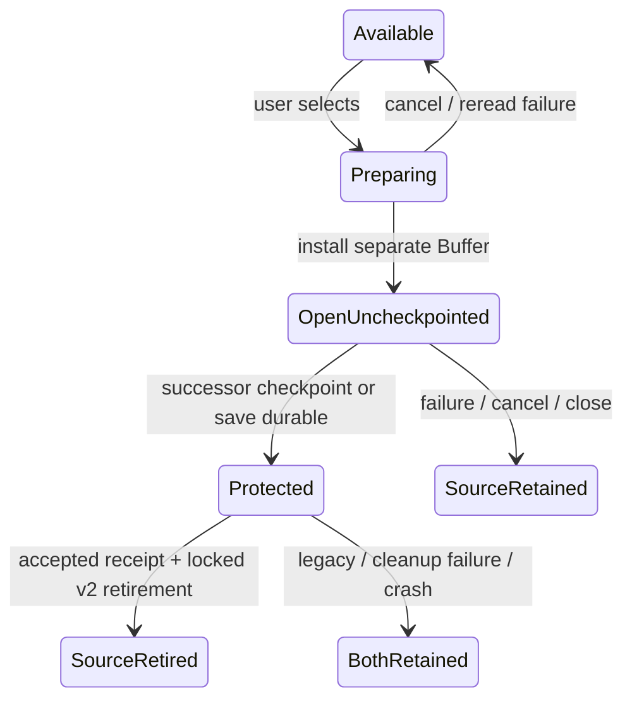

# Recovery safety — R1, R4, R5

Date: 2026-09-14. Grounding baseline: main at 9e409c0.
Status: consolidated approved product requirements; technical design is incomplete
and has not passed independent review. This is not an implementation-ready spec.
Decision history: [brainstorm](../../reviews/2026-09-11-recovery-safety-brainstorm.md).

## Problem and scope

R1: path/PID-based recovery names permit unrelated editing instances to overwrite
or delete each other's checkpoints. R4: opening a file during a session can skip
recovery assessment, then Save removes the unoffered copy. R5: recovery can delete
the old copy before a replacement checkpoint exists.

This effort covers recovery ownership, discovery across opening paths, selection,
and safe transfer. Broad checkpoint scheduling and external-write conflict policy
remain separate efforts. Recovery imports do require immediate checkpoint eligibility.

## Approved behavior

1. Open recovered text as a separate document alongside the disk version; preserve
   the disk-version buffer. Recovery itself does not overwrite the original file.
2. The recovered document starts without a save destination. First Save opens Save
   As with a distinct recovered filename suggested, retaining original-path context.
   Existing destination and overwrite checks apply to any chosen path.
3. Present multiple recovery candidates in a selection list with original filename
   where known, checkpoint time, and short preview. Open only selected candidates.
   Dismissal and leaving a candidate unselected do not delete it.
4. Each editing instance owns an independent recovery record, including unnamed
   buffers and duplicate opens of the same file across buffers/processes. Ownership
   survives Save As. A shared original path does not authorize shared cleanup.
5. Retain the source record while loading recovered text and immediately creating
   a new checkpoint. Retire that exact source only after confirmed durable storage
   and authorized cleanup. Failure keeps the source and document available and
   produces visible feedback. A crash during transfer may leave both copies.
6. Add Review Recovery Files… to reopen the selection list during a session.
   Startup and related-document opening also assess recovery. Dismissal alone must
   not cause repeated interruptions; preserved candidates remain reachable manually.

## Command-surface contract

Proposed stable command ID: `review_recovery_files`. User-approved display name:
`Review Recovery Files…`. Register through the existing command registry with the
File menu category, matching `clean_recovery`'s placement convention. The command
palette must include it; menu routing must use that same registered command.
No default keyboard shortcut is proposed. Any displayed binding hint must resolve
through the existing active-keymap machinery.

Review Recovery Files opens candidates for recovery. Existing Clean Recovery Files
retains its distinct cleanup role. Invoking review never grants deletion permission.
The selector must share the same discovery and recovery operations as contextual
opening; plugin invocation cannot bypass ownership or handoff checks.

## Technical design work still required

- Define collision-checked editing-instance ownership and record allocation separately
  from the existing DocumentId lineage hint. Specify record format and Save As metadata.
- Specify concurrent claims, source-retirement authority, generation checks, and late
  checkpoint/save completions. Process liveness alone cannot grant deletion rights.
- Define recoverable record enumeration, legacy compatibility, failed/corrupt/oversized
  reads, candidate ordering, clock semantics, and active-instance presentation.
- Define asynchronous open assessment and selector lifecycle, including plugin Open
  events, cancellation, changing selections, and revalidation before loading.
- Specify portable durability acknowledgements before source retirement. Current
  swap writes skip directory sync; RealFs directory-open failures are swallowed.
  Tests must distinguish process-crash guarantees from physical power-loss claims.
- Define how deferred records are revisited, empty/error list feedback, bounded
  previews, and recovery when the original file or directory no longer exists.

## Required evidence and next gate

Reproduce R1/R4/R5 on the baseline. Design regressions for multiple unnamed buffers,
shared named paths across processes, Save As and queued jobs, every open route,
multiple candidates, failed checkpoint/sync, crash boundaries during transfer,
legacy discovery, and selector dismissal. Include command registry/palette/menu
conformance checks. Keep IO off typing paths and avoid idle heartbeat writes.

Complete the technical design and obtain independent design review before producing
an implementation plan. Bring substantive changes to the approved behavior back to
the user; resolve routine implementation choices through grounding and review.

## Technical proposal for review — revision 1

The following resolves the technical work above as a proposed implementation design.
D1–D6 remain binding. Independent review may revise mechanisms, not product decisions.

### A. Persistent ownership and filesystem boundary

Use `<state_dir>/recovery-v2/<owner>/` for each editing instance. `owner` is an opaque
randomly suggested component, allocated by exclusive directory creation with retry
on collision. Do not infer uniqueness from DocumentId, BufferId, PID, or pathname.
Each directory contains `owner.lock` and `checkpoint.wcr`. Never unlink/recreate the
lock file or reuse an allocated owner directory. Empty owner directories are small
tombstones; their reclamation is explicitly deferred to avoid lock-inode ABA races.

Reserve a `RecoverySlot` in memory per Buffer, with lazy worker allocation on first
checkpoint. Its shared handle owns the lock lease; jobs retain the handle across
buffer closure. Path changes retain this slot; wholesale content replacement allocates
a new slot. DocumentId remains lineage metadata. The first allocating worker creates
and locks `owner.lock` before publishing a checkpoint. A concurrent enumerator sees
an incomplete directory as unavailable, never adopts it. New directory and ancestor
creation must be included in the durability sequence, not just checkpoint rename.

Add fault-injectable recovery IO capabilities, separate from existing best-effort
`Fs::sync_dir`: exclusive directory creation, nonblocking exclusive lock returning an
owned Send guard, strict directory sync, and no-follow regular-file reads for records.
`std::fs::File::try_lock` is present in pinned Rust 1.96's local std source (stable
since 1.89); use the standard-library primitive, no dependency/toolchain change.
The stable lock inode is held from owner allocation until the last Buffer/job guard
drops. Readers attempt that same lock before examining/adopting an inactive record.
Never hold two pre-existing source locks at once; selection imports are sequential.
Unsupported locks or strict sync return a typed error: preserve source and report
limited/unavailable recovery protection, never silently claim success. No PID-only
fallback and no heartbeat disk writes. Locks coordinate new-format participants;
they do not protect against arbitrary external writers bypassing the protocol.

Format: magic/version, bounded length-prefixed JSON metadata, then UTF-8 body. Use
existing serde_json. Metadata contains owner, monotonically increasing generation,
opaque lineage, document version, current association, original provenance, wall-clock
checkpoint timestamp, body byte count, and optional source owner/generation receipt.
Paths are tagged lossless platform encodings (Unix bytes / Windows UTF-16 units);
foreign-platform paths remain displayable but cannot become an automatic target.
MAX metadata = 64 KiB, body <= MAX_OPEN_BYTES; accept exactly MAX_OPEN_BYTES of body
without counting header against it. Validate byte lengths/owner/generation/UTF-8;
trailing bytes, unknown format, invalid fields are visible unavailable candidates.
Hashes are hints only: equality permitting retirement requires exact captured bytes
or an identity/version receipt within exclusive ownership, never a hash alone.
Use 0600 files and 0700 owner directories on Unix, no symlink traversal into records.

Checkpoint replacement: write temp in owner directory, flush+file sync, rename,
strict directory sync. First checkpoint also syncs newly created directories and
parents. Success receipt exists only after every required sync succeeds. If rename
succeeds but sync fails, report an uncertain checkpoint, retain transfer source, and
do not advance the acknowledged generation. Retry overwrites only this owned record.
Physical guarantees are conditional on platform/filesystem honoring these primitives;
fault tests prove operation order, and subprocess tests prove process-crash behavior.

### B. Foreground state and asynchronous lifecycle

Domain modules: `recovery_store` (format/lease/IO), `recovery_flow` (requests and
foreground transitions), `recovery_picker` (overlay interaction/painting). Existing
`recovery.rs` panic dumps stay distinct. `swap.rs` retains legacy parsing and ordinary
checkpoint policy helpers; route new checkpoint IO through the store.

A Buffer carries one RecoverySlot and a generation counter distinct from document
version, plus optional provenance/suggested Save As name. Editor carries request IDs,
scan state, selection state, and pending recovery intents. Generation changes on
content checkpoint capture and association changes. Counter exhaustion is a reported
refusal, not wraparound. Each job captures owner slot, generation, BufferId, and
RecoveryRequestId. JobKind gains `Recovery(RecoveryRequestId)`; its identity travels
through existing JobOutcome panic transport. Explicit operation data lives in the
request table, so a foreign panic cannot clear another request's wait/latch.

Jobs use the existing FIFO executor with ResultClass::Durability. A recovery merge
always routes to recovery_flow, even if its original Buffer was closed. Never decide
cleanup from whichever Buffer is active. Foreground results enqueue follow-up intents;
a shared hook drains intents with Ctx after jobs/plugin callbacks and before the final
quit barrier (real loop and e2e harness). No IO or wait is performed in render/reduce.
Scan cancellation increments its request generation; obsolete results release guards
without opening a dialog or deleting any candidate. Store failure/panic clears only
its matching in-flight state and shows a status error. Recovery import is an explicit
checkpoint trigger; it does not depend on last_edit_at or the active buffer timer.

Ordinary checkpoint failure retains existing retry behavior for now (R3 separate).
New import failure has no automatic retry loop: preserve source, visibly mark the
recovered document unprotected, and retry on the next edit/save or an explicit repeat
of recovery. Within a session, repeating an already opened source focuses its Buffer
and retries protection rather than silently creating another copy. Ordinary save to
a user-selected path may establish the durable successor instead of a checkpoint.

### C. Save, Save As, replacement, and close integration

Remove path-derived recovery deletion from save/Save As/reload/startup. Save captures
its originating RecoverySlot and content/version; only that owned slot is eligible
for cleanup. Worker checkpoint/save work is serialized by FIFO and the owner guard.
A save removes only a checkpoint generation whose body is exactly covered by the
successful save snapshot and whose association is the committed destination. Newer
or divergent checkpoints survive; failed saves retire nothing. An unchanged save may
clean its own equal checkpoint but never a discovered foreign/legacy record.

Save As keeps the slot and updates association on the accepted foreground merge.
Queue an association checkpoint if dirty content or outstanding handoff requires it;
it uses the current snapshot, never resurrects an older clean snapshot. A crash before
that association update can leave an old-path candidate, but it remains discoverable
in Review Recovery Files and does not acquire rights over another record. Quitting
waits for required recovery handoffs/association work as well as saves. The existing
post-plugin exit check must continue to rescan dirty documents after imports.

Reload and whole-buffer replacement release the old slot after its queued jobs finish;
they do not use path-based deletion or transfer it to the replacement. Explicit close
Discard cancels pending import cleanup and may leave a recovery copy conservatively.
No new automatic deletion on close is introduced. A clean saved checkpoint can be
removed only through its owned save receipt. Cleanup failure leaves a duplicate;
it does not turn a successful user save into a failed save.

### D. Discovery and all open entry points

Both runtime startup and successful Buffer installation through workspace opening or
session_restore emit an open-assessment intent with BufferId and normalized path.
Constructor-only tests remain pure. Disk content loads as today and plugin Open fires
once for that disk Buffer; it cannot erase foreign recovery because save authority
has already been narrowed. Assessment may finish after editing/switching: it never
replaces that Buffer or changes its content. Closed original Buffer does not hide
candidates; offer through the manual review command. Coalesce duplicate open intents
without losing distinct candidate generations.

Startup performs one all-candidate scan (also for named startup); contextual opens
filter associations; manual review includes all available records. Discovery is on
worker, once per request, never on idle ticks. Read one capped record at a time; keep
metadata + bounded preview, not every full body. Use raw_name to preserve path bytes.
Directory enumeration metadata scales with candidate count; no silent truncation.
Errors and unsupported/oversized/corrupt entries are visible disabled rows or an
explicit scan error, never represented as "no recovery files". Active locked owners
are shown unavailable in manual review and omitted from automatic interruption.

Legacy `.swp` files are discovered by reading their own headers, not recomputing one
path-hash filename. Recover every valid candidate, named or unnamed. Import legacy
records by copying; NEVER auto-delete/rename them, including after successful recovery,
because older binaries do not honor new locks. Legacy body reads use the old text
format with a separately bounded header allowance; invalid/unrecoverable input remains
preserved. Existing panic `recovered-*.md` dumps appear as legacy copy-only candidates
with unknown original path unless trustworthy metadata exists; protect all open dump
paths from the existing cleaner (required H19 overlap, not a full cleaner redesign).
New checkpoints never use the legacy recovered-*.md namespace. New-version ordinary
save never writes/cleans old-format checkpoints. Clean Recovery Files must exclude
legacy source records referenced by pending/open imports and all v2 owner directories;
it does not gain destructive authority from the review selector.

Sort candidates by validated wall-clock checkpoint timestamp descending, stable owner
or raw path tie-break. Legacy monotonic ts_ms cannot be displayed as civil time: label
unknown/legacy time and use filesystem mtime only as clearly labeled fallback. No
candidate is preselected or silently preferred. Remember dismissed exact candidate
generations per session; automatic discovery filters those, manual review ignores
that filter. Restart may offer still-preserved records again.

### E. Selector, recovery import, and safe retirement

Register `review_recovery_files` in File category, no default binding. One Recovery
OverlayId row supplies intercept, close, mouse and frame rendering; add it to table
bijection and paint-order tests. Up/Down navigate; Space toggles; Enter opens selected;
Esc and mouse click-away dismiss. One shared geometry computes paint/hit rectangles.
Registry/plugin replacement of the overlay has the same cancellation semantics.
Busy/progress and empty/failure states are visible. Opening command during quit or
incompatible save/close prompts refuses visibly, leaving the pending flow intact.
Automatic offers wait for a safe overlay boundary; they never replace an active prompt.

Open selected queues one import at a time. Worker locks the source (v2 only), rereads
it, and verifies exact owner+generation and bytes against the selected snapshot token;
if changed, refresh and require selection again. Preview identity is not a content
hash authorization. Legacy source is reread and kept regardless. Result owns source
lease/body until accepted or cancelled. Foreground accepts only a still-live import
request, installs a fresh ordinary Buffer with path=None, dirty=true, fresh BufferId,
new recovery owner slot, provenance and distinct Save As suggestion, and fires one
plugin Open for the recovered Buffer with no fabricated path. Preserve disk Buffer,
including a throwaway: recovered insertion never reuses it. Missing original file
still permits recovery; suggest available original parent else normal picker directory.
Name proposal is `<stem>-recovered.md` or `recovered-untitled.md`; normal overwrite
confirmation is mandatory even when the suggestion already exists.

Capture the installed content for immediate checkpoint. Keep source lease as a
handoff obligation until replacement checkpoint/save success or cancellation. User
edits may advance the buffer; the initial recovered body remains protected by the
source until its own successor is acknowledged. A newer divergent checkpoint does
not justify deleting the source without tracking that initial handoff receipt.
Once successor is durable, foreground accepts receipt, then enqueues retirement of
that exact source under the held lock. All v2 sources become inactive immutable
candidates while locked; no claim is inferred from PID. Legacy retirement is skipped.
If import is cancelled/closed before receipt acceptance, release source without
retirement. If a source file disappears or fails cleanup, preserve successor and
report only actionable error; source cleanup failure is nonfatal.

During source handoff, owner leases travel with Buffer/request/jobs and cannot be
released then reacquired by pathname for destructive cleanup. A source lock file is
never removed. No persistent index or tombstone is required to find the successor:
each complete `.wcr` is self-describing. Multiple durable copies after crash remain
available and may be grouped by provenance, never silently deduplicated.

### F. Failure matrix and transitions

| Interrupted operation | Durable copy retained | Foreground action |
| --- | --- | --- |
| Selection/prepare before Buffer installation | Source | No destructive action; retry available |
| Installation before first checkpoint | Source | Dirty Buffer; block provisional quit for active import |
| Temp write/file sync/rename failure | Source; possibly temp | Visible protection failure; no acknowledgement |
| Rename succeeds, strict sync fails | Source + uncertain successor | No source retirement |
| Success receipt queued but not applied | Source + successor | Request identity gates next action |
| User closes/replaces before acknowledgement | Source; successor if written | Cancel retirement; late merge cannot target new Buffer |
| Source retirement fails | Successor + source | Keep both; no false save failure |
| Crash after retirement | Successor | Discover independently on next launch |
| Another process holds source lock | Source | Mark busy; no steal or PID heuristic |
| Disk version saved while assessment pending | Foreign/legacy source | Save cleans only its own record |

A retirement acknowledgement additionally syncs its owner directory; failure may
resurrect source after crash, which is safe duplication. Never remove successor
until a later authorized operation establishes its own safe save/retirement condition.

### G. Review evidence and boundaries

Five existing defect-asserting R1/R4/R5 probes rerun on main 9e409c0 all pass,
confirming the defects remain. These are reproduction successes, not fixes.
Evidence: `docs/reviews/evidence/2026-09-14-recovery-design/baseline-probes.log`;
runner restores byte-identical swap.rs and isolates state. Independent source-grounding
report is `docs/reviews/2026-09-14-recovery-grounding.md`.

Implementation must add fault tests for the new exclusive-create/lock/strict-sync
seams and deterministic deferred-executor tests for every matrix edge. Real two-process
lock contention/crash tests are required; terminal smoke remains advisory and cannot
prove power-loss behavior. No broad FIFO worker redesign, version-history feature,
background heartbeat, or generic legacy cleaner rewrite belongs in this effort.
