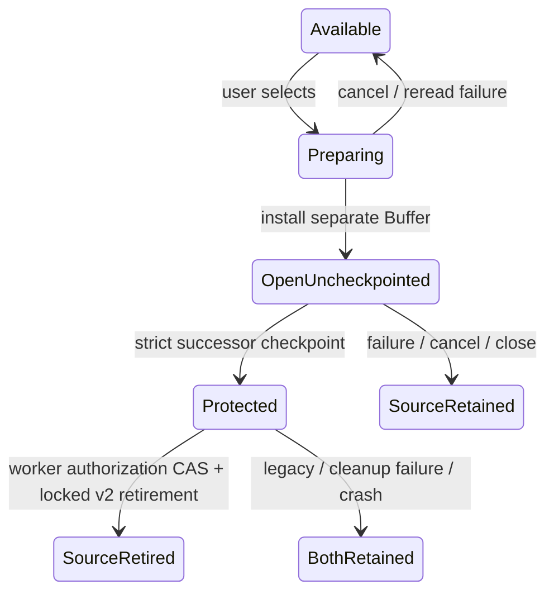

# Recovery safety — R1, R4, R5

Date: 2026-09-14. Grounding baseline: main at 9e409c0.
Status: complete technical proposal, revision 4, awaiting independent re-review.
D1–D6 are user-approved. Round 1 was NO-GO; it is preserved in the review ledger.
Do not advance to implementation planning until the technical gate clears.
Decision history: [brainstorm](../../reviews/2026-09-11-recovery-safety-brainstorm.md).

## Problem and scope

R1: path/PID-based recovery names permit unrelated editing instances to overwrite
or delete each other's checkpoints. R4: opening a file during a session can skip
recovery assessment, then Save removes the unoffered copy. R5: recovery can delete
the old copy before a replacement checkpoint exists.

This effort covers recovery ownership, discovery across opening paths, selection,
and safe transfer. Broad checkpoint scheduling and external-write conflict policy
remain separate efforts. Recovery imports do require immediate checkpoint eligibility.

## Approved behavior

1. Open recovered text as a separate document alongside the disk version; preserve
   the disk-version buffer. Recovery itself does not overwrite the original file.
2. The recovered document starts without a save destination. First Save opens Save
   As with a distinct recovered filename suggested, retaining original-path context.
   Existing destination and overwrite checks apply to any chosen path.
3. Present multiple recovery candidates in a selection list with original filename
   where known, checkpoint time, and short preview. Open only selected candidates.
   Dismissal and leaving a candidate unselected do not delete it.
4. Each editing instance owns an independent recovery record, including unnamed
   buffers and duplicate opens of the same file across buffers/processes. Ownership
   survives Save As. A shared original path does not authorize shared cleanup.
5. Retain the source record while loading recovered text and immediately creating
   a new checkpoint. Retire that exact source only after confirmed durable storage
   and authorized cleanup. Failure keeps the source and document available and
   produces visible feedback. A crash during transfer may leave both copies.
6. Add Review Recovery Files… to reopen the selection list during a session.
   Startup and related-document opening also assess recovery. Dismissal alone must
   not cause repeated interruptions; preserved candidates remain reachable manually.

## Command-surface contract

Proposed stable command ID: `review_recovery_files`. User-approved display name:
`Review Recovery Files…`. Register through the existing command registry with the
File menu category, matching `clean_recovery`'s placement convention. The command
palette must include it; menu routing must use that same registered command.
No default keyboard shortcut is proposed. Any displayed binding hint must resolve
through the existing active-keymap machinery.

Review Recovery Files opens candidates for recovery. Existing Clean Recovery Files
retains its distinct cleanup role. Invoking review never grants deletion permission.
The selector must share the same discovery and recovery operations as contextual
opening; plugin invocation cannot bypass ownership or handoff checks.

## Technical proposal for review — revision 4

The following specifies mechanisms for the approved behavior.
D1–D6 remain binding. Independent review may revise mechanisms, not product decisions.

### A. Persistent ownership and filesystem boundary

Use `<state_dir>/recovery-v2/<owner>/` for each editing instance. `owner` is an opaque
randomly suggested component, allocated by exclusive directory creation with retry
on collision. Do not infer uniqueness from DocumentId, BufferId, PID, or pathname.
Each directory contains `owner.lock` and `checkpoint.wcr`. Never unlink/recreate the
lock file or reuse an allocated owner directory. Empty owner directories are small
tombstones; their reclamation is explicitly deferred to avoid lock-inode ABA races.

Reserve a `RecoverySlot` in memory per Buffer, with lazy worker allocation on first
checkpoint. Its shared handle owns the lock lease; jobs retain the handle across
buffer closure. Path changes retain this slot; wholesale content replacement allocates
a new slot. DocumentId remains lineage metadata. The first allocating worker creates
and locks `owner.lock` before publishing a checkpoint. A concurrent enumerator sees
an incomplete directory as unavailable, never adopts it. New directory and ancestor
creation must be included in the durability sequence, not just checkpoint rename.

Add fault-injectable recovery IO capabilities, separate from existing best-effort
`Fs::sync_dir`: exclusive directory creation, nonblocking exclusive lock returning an
owned Send + Sync guard, strict directory sync, and no-follow regular-file reads for records.
`std::fs::File::try_lock` is present in pinned Rust 1.96's local std source (stable
since 1.89); use the standard-library lock primitive, no toolchain change. For Unix no-follow
regular opens add an explicit target dependency on libc 0.2.186 (already in Cargo.lock)
for O_NOFOLLOW|O_NONBLOCK constants with safe OpenOptionsExt::custom_flags; validate
opened handle metadata as regular before reading/locking. Nonblocking prevents a
FIFO replacement hanging before that validation. On Windows use safe OpenOptionsExt
with constants from a target-specific windows-sys = "=0.61.2" dependency
(feature Win32_Storage_FileSystem, already cached/locked). Use OPEN_REPARSE_POINT,
BACKUP_SEMANTICS for directory handles, and reject REPARSE_POINT/nonregular metadata. A validated
0700 recovery-v2 hierarchy is owned by this protocol beneath the trusted configured
state root; do not claim leaf no-follow checks defeat malicious ancestor replacement.
All selected legacy leaves receive the same no-follow/regular validation. Concrete
Windows constants and strict-directory capability are part of IO implementation tests;
unsupported durability must preserve copies and report the limitation.
The stable lock inode is held from owner allocation until the last Buffer/job guard
drops. Readers attempt that same lock before examining/adopting an inactive record.
Never hold two pre-existing source locks at once; selection imports are sequential.
Unsupported locks or strict sync return a typed error: preserve source and report
limited/unavailable recovery protection, never silently claim success. No PID-only
fallback and no heartbeat disk writes. Locks coordinate new-format participants;
they do not protect against arbitrary external writers bypassing the protocol.

Format: magic/version, bounded length-prefixed JSON metadata, then UTF-8 body. Use
existing serde_json. Metadata contains owner, monotonically increasing generation,
opaque lineage, document version, current association, original provenance, wall-clock
checkpoint timestamp, body byte count, and optional source owner/generation receipt.
Paths are tagged lossless platform encodings (Unix bytes / Windows UTF-16 units);
foreign-platform paths remain displayable but cannot become an automatic target.
MAX metadata = 64 KiB, body <= MAX_OPEN_BYTES; accept exactly MAX_OPEN_BYTES of body
without counting header against it. Validate byte lengths/owner/generation/UTF-8;
trailing bytes, unknown format, invalid fields are visible unavailable candidates.
Hashes are hints only: equality permitting retirement requires exact captured bytes
or an identity/version receipt within exclusive ownership, never a hash alone.
Use 0600 files and 0700 owner directories on Unix, no symlink traversal into records.

Checkpoint replacement: write temp in owner directory, flush+file sync, rename,
strict directory sync. First checkpoint also syncs newly created directories and
parents. Success receipt exists only after every required sync succeeds. If rename
succeeds but sync fails, report an uncertain checkpoint, retain transfer source, and
do not advance the acknowledged generation. Retry overwrites only this owned record.
Physical guarantees are conditional on platform/filesystem honoring these primitives;
fault tests prove operation order, and subprocess tests prove process-crash behavior.

### B. Foreground state and asynchronous lifecycle

Domain modules: `recovery_store` (format/lease/IO), `recovery_flow` (requests and
foreground transitions), `recovery_picker` (overlay interaction/painting). Existing
`recovery.rs` panic dumps stay distinct. `swap.rs` retains legacy parsing and ordinary
checkpoint policy helpers; route new checkpoint IO through the store.

A Buffer carries one RecoverySlot and a generation counter distinct from document
version, plus optional provenance/suggested Save As name. Editor carries request IDs,
scan state, selection state, and pending recovery intents. Generation changes on
content checkpoint capture and association changes. Counter exhaustion is a reported
refusal, not wraparound. Each job captures owner slot, generation, BufferId, and
RecoveryRequestId. JobKind gains `Recovery(RecoveryRequestId)`; its identity travels
through existing JobOutcome panic transport. Explicit operation data lives in the
request table, so a foreign panic cannot clear another request's wait/latch.

Jobs use the existing FIFO executor with ResultClass::Durability. A recovery merge
always routes to recovery_flow, even if its original Buffer was closed. Never decide
cleanup from whichever Buffer is active. Prepare-result merges enqueue install intents without installing Buffers or firing
plugin events. In BOTH jobs_apply::apply_job_outcome and apply_job_result, call
recovery_flow::after_job with Ctx immediately after the outcome merge, BEFORE existing
quit-drain re-drive. That hook validates the request, installs the Buffer, captures
its initial content, dispatches CheckpointAndHandoff, THEN queues plugin Open. Thus
neither quit re-drive nor Open callbacks can enqueue an earlier save for that Buffer.
Low-level apply_outcome/apply_result remain context-free; integration harness paths
must use the production wrappers, not assume these helpers dispatch follow-ups.

The distinct recovery_flow::after_callbacks hook drains new scan/open-assessment
intents and deferred selector offers, unconditionally in app::finish_iteration before
its !editor.quit early return and before quit::after_callbacks. It NEVER installs
prepared Buffers or emits plugin Open. Any asynchronously prepared Buffer returns
through the job wrapper next iteration; normal worker completion wake provides the
pump opportunity. No extra reentrant plugin pump or idle busy loop is introduced.
Both e2e step and step_timed use these same boundaries. No filesystem read/write/sync, scanning, or explicit lock wait in render/reduce.
Final lease Arc drop may perform the minimal handle-close syscall to release the
lock; destructors never sync, unlink, or retry. This is not a bounded syscall-latency
promise. Jobs retain leases so Buffer drop cannot release an in-use owner.
Scan cancellation increments its request generation; obsolete results release guards
without opening a dialog or deleting any candidate. Store failure/panic clears only
its matching in-flight state and shows a status error. Recovery import is an explicit
checkpoint trigger; it does not depend on last_edit_at or the active buffer timer.

Ordinary checkpoint failure retains existing retry behavior for now (R3 separate).
New import failure has no automatic retry loop: preserve source, visibly mark the
recovered document unprotected, and retry on the next edit/save or an explicit repeat
of recovery. Within a session, repeating an already opened source focuses its Buffer
and retries protection rather than silently creating another copy. An ordinary save cannot directly retire a handoff source. Source retirement always
uses the combined checkpoint/handoff transaction below. Later owned-checkpoint
cleanup requires the stronger RecoverySaveReceipt described in C.

### C. Save, Save As, replacement, and close integration

Remove path-derived recovery deletion from save/Save As/reload/startup. Save captures
its originating RecoverySlot and content/version; only that owned slot is eligible
for cleanup. Worker checkpoint/save work is serialized by FIFO and the owner guard.
A save removes only a checkpoint generation whose body is exactly covered by the
successful save snapshot and whose association is the committed destination. Newer
or divergent checkpoints survive; failed saves retire nothing. Every v2 checkpoint cleanup additionally requires a RecoverySaveReceipt: after
ordinary save success, in that same FIFO worker operation, open the committed target,
read/compare its complete capped bytes to the captured saved snapshot through that
SAME handle, sync that handle, then strictly sync its parent. Reopening by pathname
between compare and sync is not permitted. Do this for Saved AND Unchanged. Failure or
unsupported strict sync preserves the owned checkpoint and reports that recovery
cleanup was retained; it does not retroactively turn a successful user save into a
failed user save. Target fingerprint/association must still match the committed
operation; external uncooperative writers remain the separately recorded R7 boundary.
The receipt is used immediately within this worker operation under the owner guard,
never saved for later cleanup. This stronger cleanup check does not globally change
Fs::sync_dir semantics or ordinary file-save results. No discovered foreign/legacy
record is eligible for that cleanup.

Save As keeps the slot and updates association on the accepted foreground merge.
Queue an association checkpoint if dirty content or outstanding handoff requires it;
it uses the current snapshot, never resurrects an older clean snapshot. A crash before
that association update can leave an old-path candidate, but it remains discoverable
in Review Recovery Files and does not acquire rights over another record. Quitting
waits for required recovery handoffs/association work as well as saves. The existing
post-plugin exit check must continue to rescan dirty documents after imports.

Reload and whole-buffer replacement release the old slot after its queued jobs finish;
they do not use path-based deletion or transfer it to the replacement. Explicit close
Discard cancels pending import cleanup and may leave a recovery copy conservatively.
No new automatic deletion on close is introduced. A clean saved checkpoint can be
removed only through its owned save receipt. Cleanup failure leaves a duplicate;
it does not turn a successful user save into a failed save.

### D. Discovery and all open entry points

Both runtime startup and successful Buffer installation through workspace opening or
session_restore emit an open-assessment intent with BufferId and normalized path.
Constructor-only tests remain pure. Disk content loads as today and plugin Open fires
once for that disk Buffer; it cannot erase foreign recovery because save authority
has already been narrowed. Assessment may finish after editing/switching: it never
replaces that Buffer or changes its content. Closed original Buffer does not hide
candidates; offer through the manual review command. Coalesce duplicate open intents
without losing distinct candidate generations.

Startup performs one all-candidate scan (also for named startup). After executor
and completion wake relay initialization, call recovery_flow::bootstrap with Ctx
before the first blocking receive (including clean --no-splash startup). It dispatches
the scan using the shared intent dispatcher; it never installs a Buffer or pumps
plugins. Its job completion wakes the loop even without keyboard input. Contextual opens
filter associations; manual review includes all available records. Discovery is on
worker, once per request, never on idle ticks. Read one capped record at a time; keep
metadata + bounded preview, not every full body. Use raw_name to preserve path bytes.
Directory enumeration metadata scales with candidate count; no silent truncation.
Errors and unsupported/oversized/corrupt entries are visible disabled rows or an
explicit scan error, never represented as "no recovery files". Active locked owners
are shown unavailable in manual review and omitted from automatic interruption.

Legacy `.swp` files are discovered by reading their own headers, not recomputing one
path-hash filename. Recover every valid candidate, named or unnamed. Import legacy
records by copying; NEVER auto-delete/rename them, including after successful recovery,
because older binaries do not honor new locks. Legacy body reads use the old text
format with a separately bounded header allowance; invalid/unrecoverable input remains
preserved. Existing panic `recovered-*.md` dumps appear as legacy copy-only candidates
with unknown original path unless trustworthy metadata exists; protect all open dump
paths from the existing cleaner (required H19 overlap, not a full cleaner redesign).
New checkpoints never use the legacy recovered-*.md namespace. New-version ordinary
save never writes/cleans old-format checkpoints. Clean Recovery Files must exclude
legacy source records referenced by pending/open imports and all v2 owner directories;
it does not gain destructive authority from the review selector.

Sort candidates by validated wall-clock checkpoint timestamp descending, stable owner
or raw path tie-break. Legacy monotonic ts_ms cannot be displayed as civil time: label
unknown/legacy time and use filesystem mtime only as clearly labeled fallback. No
candidate is preselected or silently preferred. Remember dismissed exact candidate
generations per session; automatic discovery filters those, manual review ignores
that filter. Restart may offer still-preserved records again.

### E. Selector, recovery import, and safe retirement

Register `review_recovery_files` in File category, no default binding. One Recovery
OverlayId row supplies intercept, close, mouse and frame rendering; add it to table
bijection and paint-order tests. Up/Down navigate; Space toggles; Enter opens selected;
Esc and mouse click-away dismiss. One shared geometry computes paint/hit rectangles.
Registry/plugin replacement of the overlay has the same cancellation semantics.
Busy/progress and empty/failure states are visible. Opening command during quit or
incompatible save/close prompts refuses visibly, leaving the pending flow intact.
Enter with zero selections keeps the list open and says "Select a recovery file".
Esc/click-away/registry replacement record all displayed available exact tokens as
dismissed for automatic offers; subset confirmation does the same for unselected
rows and records successful selected tokens as opened. Changed/new generations may
be offered later. Manual review ignores dismissal, and opened live candidates focus
their document; changing/retrying a failed row never silently changes selection.
Automatic offers wait for a safe overlay boundary; they never replace an active prompt.

Open selected queues one import at a time. Worker locks the source (v2 only), rereads
it, and checks the concrete selection token. For v2 the token is owner+generation;
within the lock protocol a committed generation is never reused or mutated, so this
identifies the selected body without retaining every full body. For legacy the token
contains raw path, length, mtime, and full-body hash from the bounded scan. Reread
and compare that discriminator, including same-size replacements; on change show a
refreshed preview and require selection again. This is best-effort change detection,
not exact snapshot identity or deletion authority. Hash collision/concurrent legacy
writer can change selected content undetected; copying still preserves the source.
Never claim that legacy selection is an exact frozen snapshot. Source missing or
unreadable means no import, a visible row error, and progress to the next selection.
Legacy source is always retained. Result owns source
lease/body until accepted or cancelled. Foreground accepts only a still-live import
request, installs a fresh ordinary Buffer with path=None, dirty=true, fresh BufferId,
new recovery owner slot, provenance and distinct Save As suggestion, and fires one
plugin Open for the recovered Buffer with no fabricated path. Preserve disk Buffer,
including a throwaway: recovered insertion never reuses it. Missing original file
still permits recovery; suggest available original parent else normal picker directory.
Name proposal is `<stem>-recovered.md` or `recovered-untitled.md`; normal overwrite
confirmation is mandatory even when the suggestion already exists.

Capture the installed initial recovered body before plugin Open callbacks, and enqueue
one combined `CheckpointAndHandoff` worker transaction before subsequent recovery
checkpoint/save jobs for that Buffer. It owns both source lease and successor slot.
The job writes that exact captured body, strictly syncs the successor and its parents,
and then retires the exact locked v2 source in the SAME FIFO worker operation, before
any later operation can overwrite/delete the successor. No deferred foreground
retirement job or historical success receipt is used. Other process writers cannot
acquire either lease; another process scanner holding a source lock never waits for
a second existing source. Legacy jobs write the successor but skip source removal.

Foreground authorizes this transaction only after separate Buffer installation.
A shared atomic request state has Pending, Cancelled, Retiring, Finished, plus a
monotonic successor_durable flag set after strict checkpoint sync. The request table
retains this progress handle even if the job panics, so failure reporting can
distinguish pre-protection failure from uncertain cleanup completion. After
strict successor sync, worker CAS Pending->Retiring is the retirement authorization
linearization point. Cancel before that CAS wins: keep source and finish without
retirement. Cancel after it does not revoke a safe operation already authorized:
source may be retired, successor remains discoverable, and stale foreground merges
cannot affect replacement buffers. Source removal/directory-sync failures leave a
safe duplicate or uncertain source deletion, with successor already strictly durable.
Ordinary close/discard never removes successor checkpoints. Only subsequent owned
save cleanup with RecoverySaveReceipt may remove them. The FIFO worker rule is part
of the proof and must be preserved or replaced with per-owner serialization.

Pre-protection checkpoint failure/panic terminates this attempt, releases the source
lease, keeps the original, marks the document's protection failure visibly, and advances to
the next selection. Do not retain a failed source lock waiting for an optional retry.
Repeat recovery reacquires/rereads/revalidates source identity; if unchanged it focuses
the existing Buffer and retries the current document checkpoint while preserving the
old source (no deletion based on a potentially divergent retry). A future fresh import
may perform a new initial-body handoff. An edit retries ordinary protection of current
content without needing a source lock or automatically retiring the predecessor.

During source handoff, owner leases travel with Buffer/request/jobs and cannot be
released then reacquired by pathname using stale deletion authority. A source lock file is
never removed. No persistent index or tombstone is required to find the successor:
each complete `.wcr` is self-describing. Multiple durable copies after crash remain
available and may be grouped by provenance, never silently deduplicated.

### F. Terminal outcomes and quit

Request table tracks only concrete queued/running/merging work, never an indefinite
"unprotected" flag. Process selected imports sequentially through the full combined
transaction. Preparing bodies may not accumulate across the batch.

| Outcome | Lease / request / selection queue | Quit behavior |
| --- | --- | --- |
| Prepare fail/busy/panic | Release result lease; remove request; mark row, advance next | No wait after terminal outcome |
| Prepare ready after quit starts | Do not install; cancel result, release lease, discard remaining batch | Source remains; does not add dirty documents |
| Pre-protection checkpoint failure/panic | Release source on job unwind/end; keep source; remove request; mark protection failed; advance next | Cancel active waiting quit visibly; later Quit uses normal dirty review |
| Error/panic after successor_durable | Release source on unwind/end; successor survives, source may survive; remove request; report uncertain cleanup; advance next | Cancel active wait on panic; do not falsely report no protected copy |
| Success / source removal failure | Release source on transaction end; retain successor owner on Buffer/jobs; remove request; advance next | End concrete wait; apply ordinary dirty/save review |
| Esc before installation | Cancel request/batch; release any prepared lease; remove record when result drains | No new Buffer; source remains |
| Close/reload or quit Discard of installed import | Cancel pending CAS; cancel remaining batch; remove record when job drains | Wait only for current dispatched job or safe timeout; honor explicit discard |
| Five-second pending-work timeout | CAS Pending->Cancelled; detach request from exit blockers, retain it for eventual safe completion routing; show timeout | Cancel current foreground quit once; later Quit uses ordinary shutdown, including its existing worker join; worker can only retire if CAS already won with durable successor |

A failed optional checkpoint is not a permanent quit blocker. While quit is active,
no further selections install. Existing concrete handoff/association jobs must finish
or follow the timeout path; deferred UI offers wait until quit is cancelled. Apply
these checks in the shared post-callback hook before existing quit::after_callbacks.
A delayed success after timeout never reinstates quit or installs a cancelled Buffer.
The worker retains all guards through completion even if foreground no longer waits.
This timeout bounds foreground waiting state, NOT OS IO or process exit. Current
ThreadExecutor::drop joins its worker; indefinitely blocked filesystem IO can still
stall subsequent shutdown. Report "Recovery IO is still pending; quit cancelled" on
timeout. Do not detach the worker, discard queued saves, or claim cancellation of an
OS call. Broader interruptible shutdown remains separate work. Tests cover finite
controlled delay followed by release, returned errors, and documented unbounded-IO
limitations; do not add permanently hung tests to the suite.

### G. Failure matrix and transitions

| Interrupted operation | Durable copy retained | Foreground action |
| --- | --- | --- |
| Selection/prepare before Buffer installation | Source | No destructive action; retry available |
| Installation before first checkpoint | Source | Dirty Buffer; track only dispatched import work as pending |
| Temp write/file sync/rename failure | Source; possibly temp | Visible protection failure; no acknowledgement |
| Rename succeeds, strict sync fails | Source + uncertain successor | No source retirement |
| Handoff result queued but not applied | Successor; source if retained | Cleanup already decided atomically in worker; merge only updates UI |
| User closes/replaces during handoff | Source if cancel wins CAS; otherwise successor | Late merge cannot target new Buffer |
| Source retirement error/panic | Successor; source may remain after unlink/sync error | Preserve remaining copies; no false save failure or unprotected claim |
| Crash after retirement | Successor | Discover independently on next launch |
| Another process holds source lock | Source | Mark busy; no steal or PID heuristic |
| Disk version saved while assessment pending | Foreign/legacy source | Save cleans only its own record |

A retirement acknowledgement additionally syncs its owner directory; failure may
resurrect source after crash, which is safe duplication. Never remove successor
until a later authorized operation establishes its own safe save/retirement condition.

### H. Review evidence and boundaries

Five existing defect-asserting R1/R4/R5 probes rerun on main 9e409c0 all pass,
confirming the defects remain. These are reproduction successes, not fixes.
Evidence: `docs/reviews/evidence/2026-09-14-recovery-design/baseline-probes.log`;
runner restores byte-identical swap.rs and isolates state. Independent source-grounding
report is `docs/reviews/2026-09-14-recovery-grounding.md`.

Implementation must add fault tests for the new exclusive-create/lock/strict-sync
seams and deterministic deferred-executor tests for every matrix edge. Real two-process
lock contention/crash tests are required; terminal smoke remains advisory and cannot
prove power-loss behavior. No broad FIFO worker redesign, version-history feature,
background heartbeat, or generic legacy cleaner rewrite belongs in this effort.

## Revision ledger

- Revision 1: independent review NO-GO (4 Important, 2 Minor).
- Revision 2: I1 strict save cleanup receipt; I2 combined non-interleavable handoff;
  I3 terminal/quit table; I4 format-specific selection tokens; M1 zero-selection and
  suppression transitions; M2 consolidated status. Awaiting independent re-review.
- Local primitive feasibility probe: cross-process lock contention/release and
  directory sync passed on this Linux filesystem (`lock-probe.log`). This is not
  a portable integration or power-loss guarantee.

- Revision 3: I5 exact after-job installation/dispatch before quit/plugin boundaries;
  I6 foreground timeout explicitly does not interrupt IO or bound executor join;
  M3 protection progress flag and pre/post-retirement failure distinctions.
  IO grounding also specifies Unix no-follow/nonblocking constants and private-root
  trust boundary. Pending re-review.

- Revision 4: M4 dispatches bootstrap discovery before the first blocking receive.
  IO feasibility refinement adds exact cached Windows constants dependency, Send+Sync
  lease guard bound, same-handle save receipt, and explicit minimal handle-close
  exception to the foreground IO rule. Awaiting final spec review.
